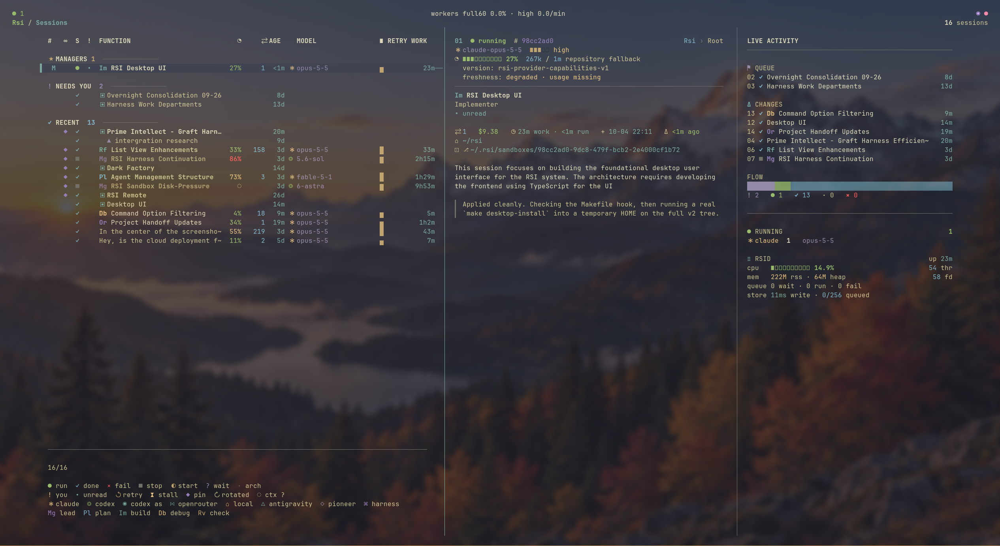

# rsi

[](https://github.com/jakedevar/rsi-cli/actions/workflows/ci.yml)
[](LICENSE)



A vim-native terminal UI for running many AI coding agents at once (Claude
Code, Codex, Antigravity, local models, or a direct API harness) from one
keyboard-driven screen.

> **Status:** alpha. Expect rough edges and breaking changes.

## Why rsi

Running one coding agent is easy. Running five at once usually means a pile of
terminal tabs, agents editing the same checkout, and no idea which one is
waiting on you. rsi gives each agent its own git worktree, keeps every session
alive in a background daemon, and puts all of them on one screen where you can
see what each is doing, what it costs, and which ones need an answer. You drive
it from the keyboard, the way you drive vim.

## Quick start

```bash
git clone https://github.com/jakedevar/rsi-cli.git && cd rsi-cli
make release-install        # builds and links rsi, rsid, rsi-rpc, rsi-agent-mcp into ~/.local/bin
rsi                         # starts the daemon and opens the TUI
```

You need Rust (rustup) and at least one signed-in agent CLI, such as
[Claude Code](https://github.com/anthropics/claude-code) or
[Codex](https://github.com/openai/codex). No subscription? Point the `Local`
provider at [Ollama](https://ollama.com). Then press `<Space>p` to add a
project, `<Space>N` to start a session, and `?` for help anywhere. Details are
under [Install](#install) and [Run](#run). To have a manager working in
minutes, see [Start here](#start-here). Before launching, use the new-session
modal's [settings backside](#new-session-settings-backside) to choose the model,
effort, sandbox, or manager role.

## Start here

Paste one of these into a session to put a manager to work. Seating a manager is
always an operator action: you run the command, the agent never appoints itself.
Full detail: [docs/harness-manager.md](docs/harness-manager.md); the two ways to
develop are in [docs/development-modes.md](docs/development-modes.md).

**First start.** RSI asks how you edit text. Press `s` for **Standard** (type
directly; the default if you are new to Vim) or `v` for **Vim**. You can change
it later in Settings > Editing Mode. Either way the session list has focus
afterwards, so the `:` commands and `<Space>` chords below work as written. In
Standard mode an opened session's text box owns every key, including `:` and `j`,
so run the `:` commands from the list and open a session (`Enter`) only to talk
to it. Press `Esc` to go back to the list (it first clears a selection or closes
a suggestion popup, so press it again). `Ctrl-H` also works on terminals with the
kitty keyboard protocol; others send it as Backspace.

**Seat a project manager on the current repo**

1. `<Space>p` (or `:projects`) opens the Workspaces picker. For a new repo press
   `Ctrl-N`, type the project name, `Tab`, type the repo's absolute path, and
   press `Enter`. The picker then lists the project: type part of its name and
   press `Enter` to open its tab.
2. `:blank Coordinate this project's work` starts a Standard root session in that
   project (`Ctrl-N` / `<Space>N` on the session list open the same prompt). Its
   row is selected once it exists.
3. With that row selected, run `:manager appoint`, keep the default scope (whole
   current project) and press `Enter`. The session moves under **MANAGERS**.
4. `:manager policy`, press `j` once to select the **Execute** preset, `Enter` to
   apply it to the draft, then `s` to save. Until Execute is saved the manager
   has no session quota and can only report status.
5. Send the manager a starter prompt below: `Enter` on its row opens it, type the
   prompt, `Enter` sends it.

**Seat a global manager over several projects**

1. Start a root session (`:blank Coordinate every project`) and select its row
   with `j`/`k`. The seat is the *selected* session, not the newest one.
2. `:manager global appoint Rsi, Notes` names the projects (comma-separated, so
   names may contain spaces; no names means every project). Check it with
   `:manager global`; revoke with `:manager global revoke`.
3. Send it a prompt. To start a brand-new project from a prompt, see the last
   starter prompt below.

**Starter prompts** (replace the angle-bracket parts)

- > Create a slice map for <goal>: split it into small, independently landable
  > Issues with acceptance criteria and dependencies, file them, then work
  > through them in order, verifying each before the next.
- > Triage the open Issues: rank them by priority and risk, close duplicates,
  > then launch workers on the top five and report evidence for each.
- > Review and harden <area>: read it, list correctness, error-handling and test
  > gaps as Issues, then fix the highest-value ones with tests.
- > Create a new project called <name> at <path> and seat a manager on it.

  This works for a project manager in Execute mode and for a global manager
  (`AgentCreateProject`; the path must exist inside the daemon's workspace
  roots). The TUI switches to the new project's tab and, for a global manager,
  asks whether to add it to the grant: press `y`. The global manager then seats
  a project manager there itself; a project manager only registers the project
  and you seat its manager with the first list above. Agents cannot delete or
  archive a project.

Inspect progress with `<Space>i` (Issues workspace), `<Space>gd` (manager
decisions awaiting you) and `<Space>n` / `:alerts` (attention history).

## What it does

- **One control plane for many agents.** A long-running daemon (`rsid`) owns
  every agent process, transcript, and status. The TUI (`rsi`) attaches over a
  Unix socket, so sessions keep running when you close the terminal.
- **Many providers.** Claude, Codex, Pioneer, Local (Ollama or any
  OpenAI-compatible server), Antigravity, the Codex app server, and a built-in
  direct-API harness. Pick the provider, model, and effort per session.
- **Isolated sandboxes.** Code-changing sessions can run in their own git
  worktree, so parallel agents never step on each other or on your checkout.
- **Structure when you need it.** Organize work into projects, Groups, and
  Epics; let an Epic lead coordinate child agents; attach a dependency DAG for
  multi-step work.
- **Built for long work.** Durable transcripts and costs in SQLite, context
  rotation through structured handoffs, scheduled wakes, and a
  research → plan → implement pipeline checked by contract validators.
- **Vim all the way down.** Modal input, `:` commands, dense layouts, and
  contextual help on `?`.

## Dependencies

rsi runs on Linux and macOS. Automatic scratch and target-directory reclamation
requires Linux filesystem proofs; macOS conservatively retains those files.

### To build

- **Rust**, through [rustup](https://rustup.rs). `rust-toolchain.toml` pins
  the version, and rustup installs it on the first build.
- **A C compiler and `make`.** SQLite and sqlite-vec are compiled from source.
  TLS uses rustls, so no OpenSSL headers are needed.
- **`git`**

One-time setup:

- Arch: `sudo pacman -S --needed base-devel git rustup`
- Debian / Ubuntu: `sudo apt install build-essential git curl`, then install rustup
- macOS: `xcode-select --install`, then install rustup

```bash
# rustup, where your OS package manager doesn't provide it
curl --proto '=https' --tlsv1.2 -sSf https://sh.rustup.rs | sh
```

### To run

At least one agent provider, installed and signed in:

| Provider | Needs |
|---|---|
| Claude | [Claude Code](https://github.com/anthropics/claude-code) CLI (`claude`) |
| Codex, Pioneer, Codex app server | [Codex](https://github.com/openai/codex) CLI (`codex`); Pioneer also needs a key in `~/.rsi/.env` |
| Antigravity | Antigravity CLI (`agy`) |
| Local | [Ollama](https://ollama.com) or any OpenAI-compatible server |
| Harness (direct API) | An API key in `~/.rsi/.env` |

`git` is also needed at run time: sandboxes are git worktrees.

RSI runs Claude Code in print mode, with a new CLI process for each resumed
turn. It sets [`CLAUDE_CODE_DISABLE_BACKGROUND_TASKS=1`](https://code.claude.com/docs/en/env-vars)
so Bash commands and subagents stay in the foreground. Claude's built-in
background tasks end with the CLI process, and restoring their stopped-task
notifications can abort the next follow-up without a reply. Use RSI-owned jobs
and wakes for long builds and tests; ordinary commands can run in the foreground.

### Optional

- **systemd user session** (Linux): lets `rsi` start `rsid` for you.
- **`xclip`** (Linux on X11): clipboard support. Wayland needs nothing extra.
- **`pandoc`**: exports the built-in manual to PDF.
- **`aws` CLI**: supplies the default region for Amazon Bedrock when
  `AWS_REGION` is unset.
- **`openclaw`**: lists the live Antigravity model catalog; a built-in list is
  used without it.

### To develop

- `cargo-watch` (installed by `./scripts/dev-tui.sh` if missing)
- `cargo-nextest` for `make test-fast`
- `cargo-deny` for license and advisory checks (`cargo deny check`)
- `python3` for the landing and helper scripts
- fontconfig and freetype headers for the TUI end-to-end test harness
  (`libfontconfig1-dev libfreetype-dev pkg-config` on Debian / Ubuntu)

### Main Rust libraries

ratatui, crossterm, and modalkit (TUI); tokio (async runtime); rusqlite with
bundled SQLite and a vendored sqlite-vec (storage); serde (protocol). Every
crate is pinned in `Cargo.lock`, and `deny.toml` limits third-party
licenses to permissive ones plus MPL-2.0.

## Install

Prebuilt Linux binaries (x86_64, arm64) and macOS binaries (Apple silicon), when
available, are attached to
[GitHub Releases](https://github.com/jakedevar/rsi-cli/releases): unpack the
archive and put its four binaries on your `PATH`.

To build from a clone of this repository:

```bash
make release-install
```

This builds release binaries and links `rsi`, `rsid`, `rsi-rpc`, and
`rsi-agent-mcp` into `~/.local/bin` (set `RSI_INSTALL_BIN_DIR` to change it).
Make sure that directory is on your `PATH`. Running it again after an update
restarts a running `rsid` on the new build: in a bounded systemd user scope on
Linux, or as a separate process on macOS.

API keys and other daemon settings go in `~/.rsi/.env`, which `rsid` reads at
startup; copy what you need from [`.env.example`](.env.example). CLI providers
use their own login instead.

## Run

Run the TUI to start `rsid` automatically if it is not already accepting
connections:

```bash
rsi
```

You can also start the daemon yourself before opening the TUI:

```bash
rsid
rsi
```

On Linux, the TUI launches `rsid` in a bounded systemd user scope with a unique
name for each launch. On macOS, it starts `rsid` as a separate process. Both
write daemon output to `~/.rsi/daemon.log`. Set
`RSI_TUI_NO_AUTO_START_DAEMON=1` to disable TUI auto-start.

First steps:

1. `<Space>p` (or `:projects`): create or pick a project for your repository.
2. `<Space>N` or `Ctrl-N` (or `:blank <objective>`): start a session.
3. `Enter` opens a session, `F3` shows exactly what it launched with, `x`
   stops it, `<Space>a` archives it, and `<Space>n` (or `:alerts`) opens notifications.
4. `?` lists the keys available wherever you are.

### New-session settings (backside)

Open the new-session modal with `<Space>N` or `Ctrl-N`. Write your prompt on
the front, then press `Ctrl+O` in any mode to flip to the settings backside.
Alternatively, press `Esc` to leave insert mode (dismiss any suggestions first),
then press `Tab` in normal mode. Flipping preserves your prompt and editing mode.

| Key on the backside | Action |
|---|---|
| `j` / `k` or `Down` / `Up` | Select a setting |
| `h` / `l` or `Left` / `Right` | Cycle values backward / forward |
| `Space` or `Enter` | Open the model picker, toggle a setting, or cycle forward |
| `Ctrl+O`, `Tab`, or `Esc` | Return to the prompt |
| `?` | Show help for the current side |
| `Ctrl+Enter` | Launch with the current prompt and settings from either side |

Choose **Model** (provider and model), **Effort**, and **Sandbox** (git-worktree
isolation, when supported). With a project selected, enable **Manager** to
appoint the new session at launch; **Scope** and **Policy** then appear. Scope
can cover the project or a live Group or Epic; policy cycles through **Observe**,
**Execute** (default), and **Full project control**. Appointing replaces the
project's current manager. Plain `Enter` on the backside changes a setting;
use `Ctrl+Enter` to launch.

The [operator manual](docs/agent-harness-operator-manual.md) covers daily use,
and [docs/keybindings.md](docs/keybindings.md) is the full key reference.
State lives in `~/.rsi/`: `rsi.db` (SQLite), `daemon.sock`, and `logs/`.

## Develop

```bash
./scripts/dev-daemon.sh   # cargo run --bin rsid
./scripts/dev-tui.sh      # rebuilds and relaunches the TUI on change (cargo-watch)
make test-fast            # daemon unit tests (needs cargo-nextest)
```

The main crates are `rsi` (TUI, built on ratatui and modalkit), `rsid`
(daemon), and `rsi-common` (shared types, JSON-RPC protocol, validators);
supporting crates live under `crates/`. [AGENTS.md](AGENTS.md) holds the
conventions AI agents follow when working in this repository.

## License

rsi is free software under the
[GNU Affero General Public License v3.0 only](LICENSE). Commercial licenses
are available on request. See [NOTICE](NOTICE) for copyright, credits, and
third-party licenses, and [CONTRIBUTING.md](CONTRIBUTING.md) before sending
code.

## Thanks

rsi grew out of ideas from [HumanLayer](https://github.com/humanlayer/humanlayer),
Jake Van Clief and David McDermott's
[Interpretable Context Methodology](https://arxiv.org/abs/2603.16021), and
Stanford's [Meta-Harness](https://arxiv.org/abs/2603.28052) paper.
