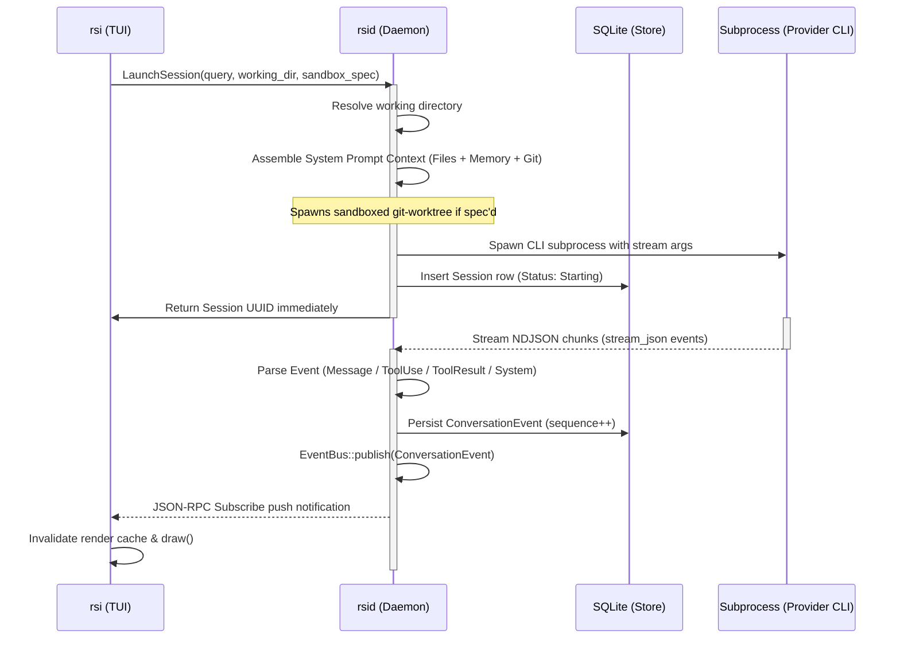
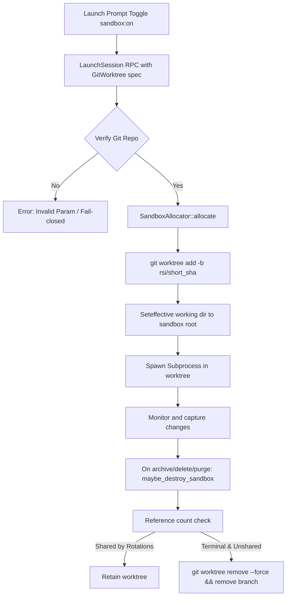

# Feature-Architecture Map

This document bridges the user-facing features of the `rsi` application with their internal architectural layouts. It outlines how commands, UI inputs, and background workflows flow through the client, daemon, and shared libraries.

---

## 1. Subsystem Interaction Matrix

| User-Facing Feature | Client-Side Trigger / View | Daemon-Side Coordinator | Data & State Layer |
|---|---|---|---|
| **Multi-session Chat** | [ui/session.rs](file:///home/jakedevar/rsi/crates/rsi/src/ui/session.rs) | [session/monitor.rs](file:///home/jakedevar/rsi/crates/rsid/src/session/monitor.rs) | `sessions` & `conversation_events` tables |
| **Vim Splits & Tabs** | [layout.rs](file:///home/jakedevar/rsi/crates/rsi/src/app/layout.rs) | *N/A (Client local state)* | `PersistedState` (tab & split indexes) |
| **Sandbox Isolation** | Toggle `s` in [overlay/prompt.rs](file:///home/jakedevar/rsi/crates/rsi/src/overlay/prompt.rs) | [sandbox/mod.rs](file:///home/jakedevar/rsi/crates/rsid/src/sandbox/mod.rs) | `sandbox_*` columns in SQLite |
| **Context Rotation** | Alert in [ui/session.rs](file:///home/jakedevar/rsi/crates/rsi/src/ui/session.rs) | [session/rotation.rs](file:///home/jakedevar/rsi/crates/rsid/src/session/rotation.rs) | Parent UUID continued-from mapping |
| **Memory Search** | `<Space>M` in [overlay/mod.rs](file:///home/jakedevar/rsi/crates/rsi/src/overlay/mod.rs) | [memory/search/mod.rs](file:///home/jakedevar/rsi/crates/rsid/src/memory/search/mod.rs) | `memory.sqlite` (chunks & FTS5 index) |
| **Agentic Q&A** | `:ask` or [overlay/mod.rs](file:///home/jakedevar/rsi/crates/rsi/src/overlay/mod.rs) | [dialectic/mod.rs](file:///home/jakedevar/rsi/crates/rsid/src/dialectic/mod.rs) | Prefetched memory and sessions context |
| **Task DAGs** | `:dag` or [ui/vitals.rs](file:///home/jakedevar/rsi/crates/rsi/src/ui/vitals.rs) | [session/graph_runner.rs](file:///home/jakedevar/rsi/crates/rsid/src/session/graph_runner.rs) | `recursive_dag` tables |
| **Project Settings** | `:settings` or [ui/settings.rs](file:///home/jakedevar/rsi/crates/rsi/src/ui/settings.rs) | [config.rs](file:///home/jakedevar/rsi/crates/rsid/src/config.rs) | `Store` project metadata tables |

---

## 2. Core Architectural Pipelines

### A. Session Launch and Execution Pipeline

1. **Client Action**: When a user inputs a prompt and submits it via [prompt.rs](file:///home/jakedevar/rsi/crates/rsi/src/overlay/prompt.rs), the client makes a `LaunchSession` JSON-RPC request using [client.rs](file:///home/jakedevar/rsi/crates/rsi/src/client.rs).
2. **Context Compilation**: The daemon [launch.rs](file:///home/jakedevar/rsi/crates/rsid/src/session/launch.rs) instantiates [context_pipeline.rs](file:///home/jakedevar/rsi/crates/rsid/src/session/context_pipeline.rs) to gather project files, git history, and memory chunks within token limits.
3. **Subprocess Management**: The daemon launches the provider CLI configured in [provider.rs](file:///home/jakedevar/rsi/crates/rsid/src/provider.rs) and spawns a background thread [monitor.rs](file:///home/jakedevar/rsi/crates/rsid/src/session/monitor.rs) to parse stdout.
4. **Push Updates**: Output is routed into the [bus.rs](file:///home/jakedevar/rsi/crates/rsid/src/bus.rs) EventBus, pushing data to the TUI's [notification_stream.rs](file:///home/jakedevar/rsi/crates/rsi/src/notification_stream.rs). The client invalidates its rendering [app/cache.rs](file:///home/jakedevar/rsi/crates/rsi/src/app/cache.rs) and triggers redraws.

---

### B. Sandbox Lifecycle Management

1. **Initialization**: If sandboxing is toggled in [overlay/prompt.rs](file:///home/jakedevar/rsi/crates/rsi/src/overlay/prompt.rs), the daemon invokes [sandbox/mod.rs](file:///home/jakedevar/rsi/crates/rsid/src/sandbox/mod.rs).
2. **Worktree Creation**: [sandbox/git_worktree.rs](file:///home/jakedevar/rsi/crates/rsid/src/sandbox/git_worktree.rs) runs shell commands to clone a fresh worktree, ensuring filesystem isolation.
3. **Cleanup**: Upon session deletion or archiving, [session/lifecycle.rs](file:///home/jakedevar/rsi/crates/rsid/src/session/lifecycle.rs) runs `maybe_destroy_sandbox`, checking if other sessions in a rotation chain share the sandbox. If not, it executes a force removal and prunes the git references.

---

### C. Context Rotation & Compaction

1. **Threshold Crossed**: As the provider stream is parsed in [session/monitor.rs](file:///home/jakedevar/rsi/crates/rsid/src/session/monitor.rs), tokens are counted. If usage reaches 65% of the context window, the [session/rotation_coordinator.rs](file:///home/jakedevar/rsi/crates/rsid/src/session/rotation_coordinator.rs) transitions the state machine to `PendingInterrupt`.
2. **Interruption**: The daemon sends a `SIGINT` to the subprocess using [nix::signal](file:///home/jakedevar/rsi/crates/rsid/src/session/lifecycle.rs) and sets the status to `Interrupted`.
3. **Handoff Generation**: The daemon launches a quick helper session running `/create_handoff`. The subprocess writes a structured summary markdown file matching [rsi-common/src/handoff_schema](file:///home/jakedevar/rsi/crates/rsi-common/src/handoff_schema).
4. **Lineage Continuation**: The rotation coordinator archives the parent session, then launches a new child session using [session/rotation.rs](file:///home/jakedevar/rsi/crates/rsid/src/session/rotation.rs) configured with `/resume_handoff <file_path>`, inheriting the sandbox workspace.

---

### D. Memory Indexing and Hybrid Search

1. **File Tracking**: The daemon inotify watcher [memory/watcher.rs](file:///home/jakedevar/rsi/crates/rsid/src/memory/watcher.rs) monitors directories. Changes trigger re-indexing in [memory/reindex.rs](file:///home/jakedevar/rsi/crates/rsid/src/memory/reindex.rs).
2. **Chunking**: Text is split in [memory/chunking.rs](file:///home/jakedevar/rsi/crates/rsid/src/memory/chunking.rs) into token-bounded chunks.
3. **Embeddings**: Chunks are passed to [memory/llm.rs](file:///home/jakedevar/rsi/crates/rsid/src/memory/llm.rs) to fetch embeddings from LLM providers, then cached in `memory.sqlite` [memory/store.rs](file:///home/jakedevar/rsi/crates/rsid/src/memory/store.rs).
4. **Hybrid Search**: [memory/search/mod.rs](file:///home/jakedevar/rsi/crates/rsid/src/memory/search/mod.rs) receives search queries, queries FTS5 text blocks and vector columns, merges scores, and applies temporal decay and MMR diversity algorithms to return the most relevant results.

---

### E. Dialectic Agent Q&A (`:ask`)

1. **Trigger**: The user types `:ask <query>` in the client command bar [commands.rs](file:///home/jakedevar/rsi/crates/rsi/src/commands.rs), opening the dialectic view.
2. **Agent Loop**: The daemon [dialectic/mod.rs](file:///home/jakedevar/rsi/crates/rsid/src/dialectic/mod.rs) enters a multi-turn loop. It compiles a system prompt with context from the memory system.
3. **Tool Dispatch**: The model can choose to call tools defined in [dialectic/tools.rs](file:///home/jakedevar/rsi/crates/rsid/src/dialectic/tools.rs) (such as `search_memory` or `list_sessions`).
4. **Response**: Once the agent returns its final answer, the TUI renders the markdown output.

---

### F. Recursive DAG Task Scheduler (`:dag`)

1. **Graph Setup**: Workflow graphs are loaded from `recursive_dag` tables via the client `:dag` parser [commands.rs](file:///home/jakedevar/rsi/crates/rsi/src/commands.rs).
2. **Dependency Resolution**: [session/graph_runner.rs](file:///home/jakedevar/rsi/crates/rsid/src/session/graph_runner.rs) steps through task nodes. Unblocked tasks with satisfied dependency edges are queued.
3. **Execution**: The scheduler spawns subprocess runs. Output validation checks execute, and outputs are committed through the validation pipeline.
4. **Visualization**: Graph execution status is bridged in [session/topology_bridge.rs](file:///home/jakedevar/rsi/crates/rsid/src/session/topology_bridge.rs) and rendered in the TUI client [ui/mini_dag.rs](file:///home/jakedevar/rsi/crates/rsi/src/ui/mini_dag.rs).
